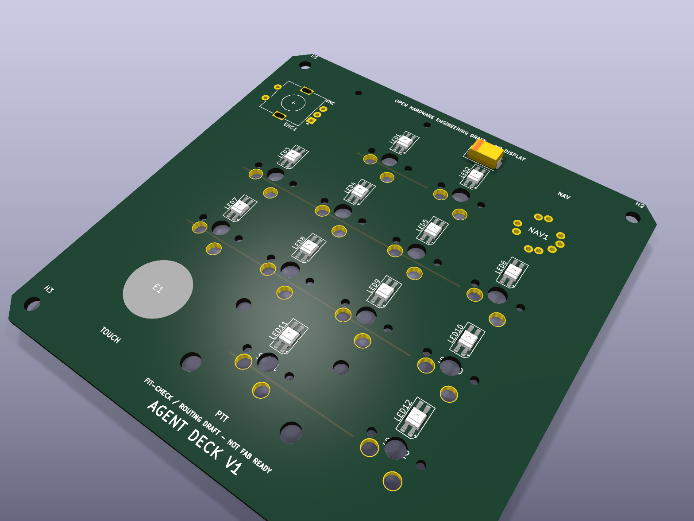
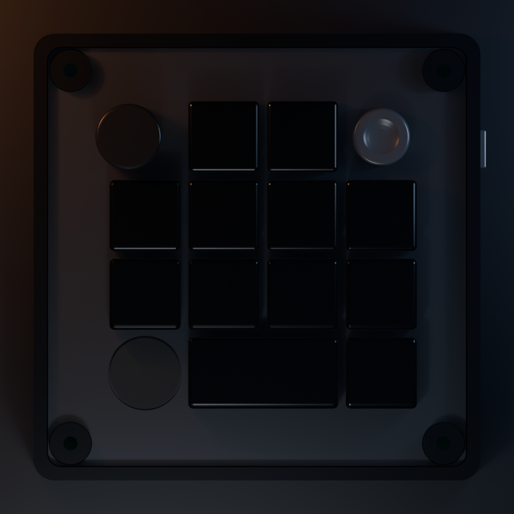
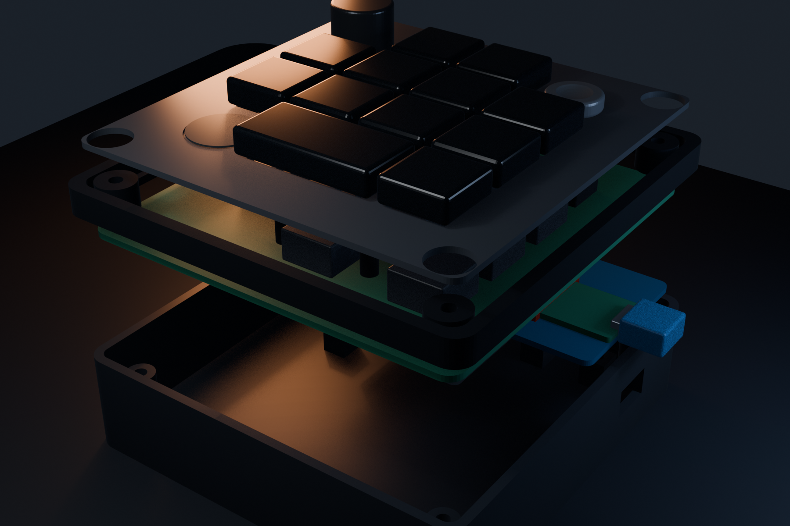
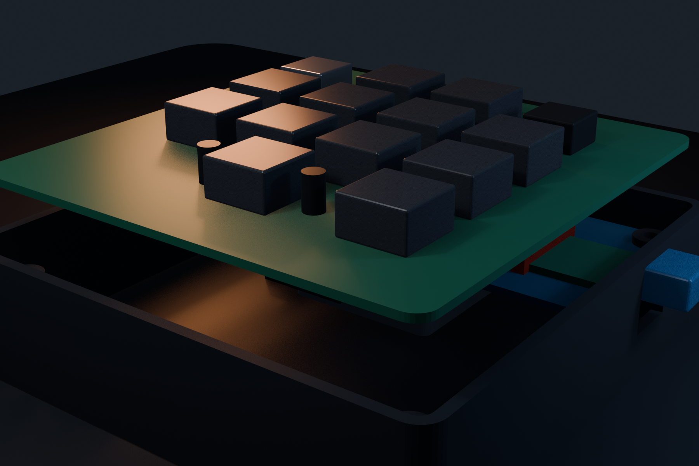

# Agent Deck

Codex, Hermes, OMX, tmux 같은 AI 에이전트 작업을 물리적으로 제어하고 상태를 RGB로 표시하는 데스크톱 컨트롤러 프로젝트입니다.

이 프로젝트는 공개된 제품 경험을 참고하되, 공개되지 않은 OpenAI Micro의 회로·펌웨어·프로토콜을 추정하거나 복제하지 않습니다. 목표는 기능적으로 유사한 사용자 경험을 제공하는 독자 설계입니다.

## V1 범위

- PCB 고정형 MX 호환 기계식 키 12개, Kailh 핫스왑 소켓, 키별 다이오드. 터치 오른쪽 K11은 기본 2u 마이크/PTT 키
- 전체 12키 개별 RGB 상태 표시
- 클릭 가능한 로터리 엔코더 1개
- 낮은 원형 오목 캡을 씌운 5방향 디지털 내비게이션 스위치 1개
- 단일 원형 정전식 터치 패드 1개
- XIAO ESP32-S3 Plus와 XIAO nRF52840 Plus 비교 평가
- USB HID, Vendor HID, BLE HID 및 상태 통신 실험
- Codex/Hermes/OMX/tmux 상태를 정규화하는 PC 브리지
- USB 전원 우선 검증 후 1셀 Li-Po 평가

OLED나 LCD는 사용하지 않습니다. 모든 입력 부품은 브레드보드가 아니라 입력 PCB에 직접 실장합니다.

## 현재 기준 설계

V1은 공용 입력 PCB와 MCU별 어댑터 보드를 사용합니다. 입력 PCB에는 키 매트릭스, MCP23017, 내비게이션 스위치, 정전식 터치 IC, 엔코더, RGB LED 및 전원 보호 회로를 두고, 어댑터는 XIAO 보드별 핀·전원·USB 차이를 흡수합니다.

- 키 12개: 5핀 MX 호환 스위치, Kailh `CPG151101S11-16` 핫스왑 소켓, 다이오드를 포함한 4×4 매트릭스. K11은 호스트 음성 입력을 누르는 동안만 여는 기본 PTT 매핑
- MCP23017: 키 매트릭스, 5방향 스위치, 터치 출력 처리
- 엔코더 A/B/클릭: MCU 직접 연결
- 터치: AT42QT1010 계열 외부 IC 우선
- RGB: 5V 주소 지정 LED, 74AHCT1G125 레벨 시프터, 전류 제한 전원 스위치
- USB-C: V1에서는 장착한 XIAO의 온보드 USB-C를 케이스 밖으로 노출
- 배터리: 어댑터 측에서 각 XIAO의 충전·배터리 회로를 사용하고 공용 PCB에 충전기를 중복하지 않음

정확한 주문 부품과 보드 리비전은 [V1 핏체크 부품 기준](docs/hardware/v1-fit-check-parts.md)에 따라 실물 샘플과 공식 도면으로 다시 잠급니다.

## KiCad V1 엔지니어링 드래프트

현재 저장소에는 다음 실제 KiCad 설계 소스가 있습니다.

- 공용 입력 PCB: 12키, 12다이오드, 키별 RGB 12개, MCP23017, EC11, 5방향 입력, AT42QT1010 터치, TPS2553 RGB 전류 제한, AHCT 레벨 시프터
- XIAO ESP32-S3 Plus 전용 어댑터
- XIAO nRF52840 Plus 전용 어댑터
- 세 보드의 블록 회로도와 재현 가능한 생성 스크립트

이 파일은 부품 배치, 전기 넷, 기구 기준점을 검토하기 위한 엔지니어링 드래프트입니다. 세 블록 회로도는 ERC 0건이며 현재 배치에서 DRC 오류도 0건이지만, 공용 PCB 117개와 각 어댑터 21개의 연결이 의도적으로 미배선 상태입니다. 블록 회로도는 아직 PCB 전체 부품과 1:1 패리티를 갖는 제작 회로도가 아닙니다. 따라서 현재 파일은 PCB 제작용 릴리스가 아닙니다. 검증 결과와 제작 중지 조건은 [KiCad 검증 기록](hardware/kicad/VALIDATION.md)에 있습니다.

## 3D 프린트 케이스 핏체크

현재 PCB 좌표에서 생성한 하판, 상부 베젤, 12키 1.5 mm MX 플레이트 STL이 `mechanical/exports/v1-fit-check/`에 있습니다. 공개 외형처럼 상단은 엔코더–키 2개–내비게이션 컨트롤, 하단은 터치–2u PTT–보조 키로 배치했습니다. 모든 키캡은 각인 없는 검정 반투명 스모크 재질을 의도하며, 1u와 2u 키를 19 mm 격자와 1.8 mm 명목 간격으로 정렬했습니다.

공용 PCB는 100 × 100 mm, 케이스 몸체는 107.8 × 107.8 × 33.17 mm입니다. 내부 모델은 81 × 43 mm MCU 어댑터, 7.47 mm 커넥터 핏체크 스택, XIAO/USB 및 RF 영역, 34.5 × 45 × 6 mm 배터리 후보, U1·C30·핫스왑 소켓, 2u 스태빌라이저와 케이블 여유 공간을 포함합니다. STL 세 개는 생성 시 manifold 검사를 통과했지만, 실제 부품 공차와 배터리 팽창은 샘플 조립으로 확인해야 합니다.

## 문서 지도

- [제품·물리 인터페이스 디자인 계약](DESIGN.md)
- [제품 요구사항](.omx/plans/prd-agent-deck-v1.md)
- [검증 계획](.omx/plans/test-spec-agent-deck-v1.md)
- [시스템 아키텍처](docs/architecture/system-architecture.md)
- [XIAO 핀 호환성](docs/hardware/pin-compatibility.md)
- [전기 설계 제안](docs/hardware/electrical-proposal.md)
- [부품·기구 결정 체크리스트](docs/hardware/design-inputs-checklist.md)
- [V1 핏체크 부품 기준](docs/hardware/v1-fit-check-parts.md)
- [V1 프로토타입 BOM](docs/hardware/prototype-bom.csv)
- [장치 프로토콜](docs/protocol/device-protocol.md)
- [공식 자료 목록](docs/research/source-register.md)
- [KiCad 구조](hardware/kicad/README.md)
- [KiCad 검증 기록](hardware/kicad/VALIDATION.md)
- [펌웨어 구조](firmware/README.md)
- [PC 브리지 구조](bridge/README.md)
- [기구 설계 구조](mechanical/README.md)
- [3D 프린트 케이스 핏체크](mechanical/enclosure/README.md)
- [2026-07-16 호스트·CAD 검증 증거](docs/test-evidence/2026-07-16-v1-baseline.md)

## 제작 순서

1. 두 MCU의 최소 펌웨어와 통신 경로를 개발 보드에서 검증
2. 공식 핀맵·회로도와 선택 부품 데이터시트로 회로도 작성
3. 입력 PCB와 MCU 어댑터 PCB 설계 및 DRC/ERC
4. 스위치 플레이트 설계
5. 케이스와 USB/안테나/배터리 간섭 검증
6. 조립 및 전기적 안전 검사
7. USB/BLE/입력/RGB/전력/재연결/위험 동작 E2E 테스트

## 상태

요청한 후속 작업 1~5의 저장소 기준 베이스라인을 구현했습니다.

1. 부품 후보와 주문 전 실물 확인 게이트를 문서화했습니다.
2. 배터리–MCU 어댑터–공용 PCB–플레이트 전체 케이스 스택과 출력용 STL을 만들었습니다.
3. 공용 PCB와 두 어댑터를 실제 핏체크 배치로 갱신하고 ERC/DRC를 실행했습니다.
4. ESP32-S3/nRF52840 공통 펌웨어 코어와 보드별 fail-closed 포트 골격을 구현했습니다.
5. 프로토콜, 세션 상태, 안전 정책, PTT 수명주기, fixture/tmux/Codex 읽기 전용 어댑터를 포함한 PC 브리지를 구현했습니다.

호스트 테스트와 CAD 검증은 통과했지만 실물 MCU·USB/BLE·전원·터치·RF 검증과 PCB 배선은 남아 있습니다. 특히 DRC 오류 0건은 미배선이 없다는 뜻이 아닙니다. 현재 보드는 Gerber 생성이나 주문 단계가 아닙니다.
