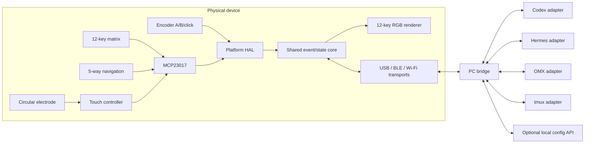
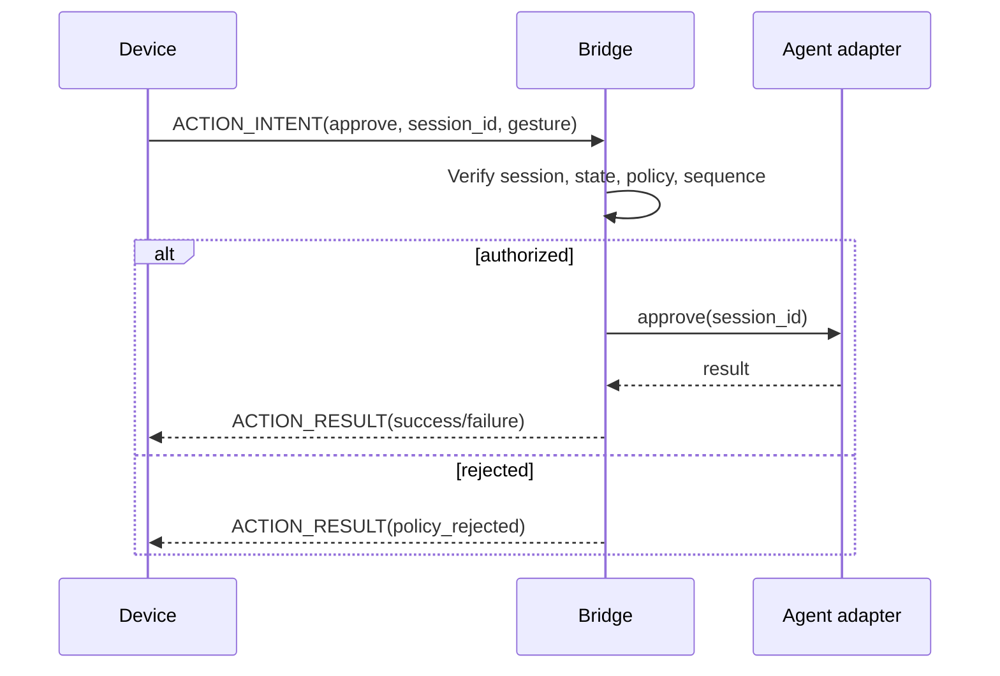

# System architecture

## Scope

Agent Deck is a physical controller and status surface for local AI-agent workflows. It does not embed Codex, Hermes, OMX, or tmux. A host bridge owns process discovery, session identity, state interpretation, and authorization; the device owns tactile input, local feedback, transport, and offline-safe behavior.

## Top-level flow

## Responsibility boundaries

### Common input PCB

- Owns the physical layout of all controls.
- Scans low-speed controls through MCP23017.
- Conditions encoder, touch, RGB, and power signals.
- Exposes only semantic signals to the adapter connector.
- Contains no assumptions about ESP32 or nRF GPIO numbering.

### MCU adapter

- Maps semantic signals to one XIAO board revision.
- Owns board-specific reset/boot/debug access, USB placement, antenna keep-out, and battery connection.
- Prevents use of reserved battery, USB, NFC, JTAG, or strapping signals unless explicitly designed.
- Provides identification straps or firmware build identity so the common firmware configuration cannot silently target the wrong board.

### Firmware common core

- Converts raw inputs to stable semantic events.
- Maintains selected agent/session display state and transport health.
- Implements protocol framing, capability negotiation, sequence handling, and stale-state expiry.
- Applies local brightness/current limits and never invents host authorization.

### Platform ports

- ESP32-S3: ESP-IDF GPIO/I2C/TinyUSB/BLE/Wi-Fi implementation.
- nRF52840: Zephyr/nRF Connect SDK GPIO/I2C/USB/BLE implementation.
- Both expose the same interfaces described in `firmware/README.md`.

### PC bridge

- Discovers and tracks sessions through isolated integration adapters.
- Normalizes upstream state to the device state model.
- Routes input events to the selected session.
- Validates session identity and state before any sensitive action.
- Persists user mappings and emits an audit record for guarded actions.

## State model

The minimum host-to-device state set is:

- `idle`
- `running`
- `waiting_approval`
- `waiting_input`
- `completed`
- `failed`
- `disconnected` for device-local fail-safe rendering

`disconnected` is not an upstream agent state. Firmware enters it when the bridge heartbeat expires.

## Action model

Inputs produce semantic action intents such as `select_next_session`, `approve`, `reject`, or `interrupt`. The device does not decide whether an agent command is valid. The bridge resolves the current selected session, verifies the required state, applies confirmation policy, executes through the owning integration adapter, and returns an acknowledgement.

## Transport strategy

- USB HID is the basic host-control compatibility path.
- Vendor HID is the preferred V1 bidirectional USB message path.
- BLE HID plus a custom GATT service provides the wireless equivalent.
- ESP32-S3 Wi-Fi WebSocket is an experiment behind the same protocol adapter, not a required dependency for device semantics.
- CDC serial is reserved for diagnostics and bring-up; product behavior must not require parsing console text.

## Failure behavior

- Bridge heartbeat expiry clears selected-action eligibility and shows the disconnected RGB pattern.
- Duplicate or stale sequence numbers are ignored and acknowledged as such.
- Reconnection starts with capability negotiation and a complete state snapshot.
- Pending confirmations are cancelled by session changes, transport changes, device reset, or bridge restart.
- The device never replays buffered sensitive actions after reconnection.
