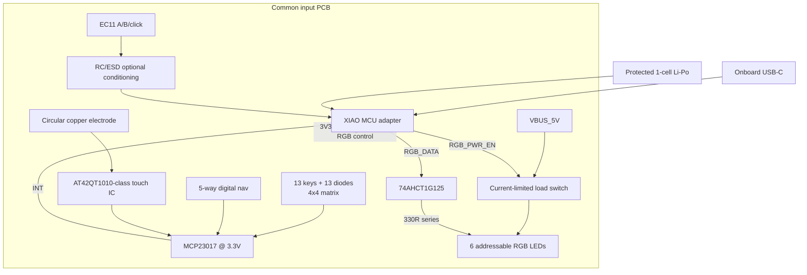

# V1 electrical proposal

This is a design baseline, not a released schematic. Exact footprints, ratings, thresholds, and power cases require manufacturer-data-sheet review and bench verification.

## Block diagram

## Key matrix

- Arrange 13 switches in a 4-row × 4-column logical matrix; leave three locations unpopulated.
- Add one 1N4148W-class diode per key with a single documented current direction.
- Put all eight row/column lines on MCP23017 port A: `GPA0..3 = ROW0..3`, `GPA4..7 = COL0..3`.
- Scan one driven row at a time and read columns. Exact active polarity is fixed by the diode orientation and recorded in the schematic notes.
- Hot-swap footprint choice waits for MX versus Choc selection; do not create a universal overlapping footprint without a mechanical and assembly review.

## MCP23017 allocation

| MCP23017 pin | Net | Use |
| --- | --- | --- |
| GPA0–GPA3 | `ROW0`–`ROW3` | Key matrix drive |
| GPA4–GPA7 | `COL0`–`COL3` | Key matrix sense |
| GPB0 | `NAV_UP_N` | Navigation input |
| GPB1 | `NAV_DOWN_N` | Navigation input |
| GPB2 | `NAV_LEFT_N` | Navigation input |
| GPB3 | `NAV_RIGHT_N` | Navigation input |
| GPB4 | `NAV_CENTER_N` | Navigation input |
| GPB5 | `TOUCH_OUT` | Touch controller digital output |
| GPB6–GPB7 | `SPARE_IOX0/1` | Test pads, uncommitted |
| INTB | `IOX_INT` | Navigation/touch interrupt to MCU |
| INTA | DNP/test pad | Optional matrix/diagnostic interrupt |

Use 3.3 V supply, local 100 nF decoupling, address straps with explicit resistors, I2C pull-ups sized after bus capacitance is known, and a connector-visible reset/test strategy. V1 keeps the expander because it makes the common adapter interface small and deterministic. V2 may remove it if measured latency, sleep current, cost, or availability outweighs the layout benefit.

## Navigation switch choice

### Direct digital inputs through MCP23017 — recommended

Advantages:

- No ADC-reference or threshold differences between MCUs.
- Simple per-direction diagnostics and deterministic center event.
- Clear handling of simultaneous contacts.
- No extra MCU pins because the expander already exists.

Costs:

- Five expander pins and a larger switch footprint.
- I2C sampling/interrupt latency, which must be measured.

### Resistor ladder to one ADC

Advantages:

- One MCU analog input and fewer connector signals if no expander is used.

Costs:

- Thresholds vary with resistor tolerance, ADC gain/reference, supply, noise, and board calibration.
- Simultaneous directions may create ambiguous voltages.
- ESP and Nordic ADC behavior requires separate calibration.
- D16 cannot be reused because it is reserved for battery sensing.

Decision: use five digital contacts on MCP23017 for V1. Keep a resistor-ladder test coupon only if future cost or pin pressure justifies it.

## Encoder

- Use an EC11-class encoder with metal mounting tabs and a locked shaft height.
- Connect A, B, and click directly to `ENC_A`, `ENC_B`, and `ENC_SW` on the adapter.
- Provide optional DNP RC footprints so edge shaping can be tuned after scope measurements.
- Use Schmitt-capable GPIO input configuration where available and decode quadrature with a transition table, not independent edge counters.
- The plate or enclosure must support actuation torque; solder pads are not the only mechanical restraint.

## Touch

- Use one round copper electrode with a keep-out from noisy RGB and USB traces.
- Use an AT42QT1010-class one-channel controller to keep MCU behavior common.
- Connect its digital output to MCP23017 GPB5.
- Implement tap, long press, and double tap from timestamps in the common firmware layer.
- Do not claim swipe recognition from one electrode. Swipe requires a later multi-electrode and controller redesign.
- Add a tuning/test coupon for electrode diameter, overlay thickness, ground hatch, and sensitivity component before freezing the enclosure.

## RGB and power

- Six SK6812 Mini-E-compatible addressable RGB LEDs are the optical baseline; verify exact package and footprint before layout.
- Feed data through a 74AHCT1G125-class 3.3 V-to-5 V buffer. Keep output enable in a defined state.
- In the V1 draft, power the buffer from `VBUS_5V` and use an MMBT3904-class inverter so the active-low output enable follows `RGB_PWR_EN`: reset/default-low disables both the TPS2553 and the data driver.
- Place approximately 330 ohm in series with the first LED data input and route the chain away from the touch electrode.
- Place 100 nF at each LED plus at least one local 10 uF and one board-entry bulk capacitor; final bulk value follows transient measurement.
- Feed the LED rail through a current-limited load switch with default-off enable. Candidate families include TPS2553 or AP22653; exact current-set value is selected after LED current measurements.
- The current KiCad draft uses TPS2553DBVR with a 232 kOhm 1% `ILIM` candidate, approximately 117 mA typical from TI's equation. This is a starting point, not a guaranteed maximum; tolerance and transient testing decide the release value.
- Calculate traces and connectors for the LED data-sheet worst case, but set a lower firmware budget. A provisional product budget is 120 mA total for all six LEDs until optical testing proves a lower value.
- On USB power, `VBUS_5V` supplies the LED switch. In initial battery-only testing, RGB may remain disabled. Full battery-mode RGB requires a separately reviewed boost/power-mux design and is not silently powered from an undefined XIAO 5 V pin.

## Power partition

- The common PCB consumes 3.3 V for MCP23017, touch, and logic.
- Each adapter owns its XIAO battery pads, charge behavior, reset/boot, and USB placement.
- The common PCB must not add a second Li-Po charger while the XIAO charger is in circuit.
- Use a protected cell and keyed connector after polarity is locked.
- Provide current measurement points for total device, RGB rail, and 3.3 V logic.
- First power-up always uses a current-limited bench supply with the XIAO removed, then with one adapter installed.

## Protection and layout provisions

- Add ESD protection where external metal or connector exposure warrants it; exact parts depend on connector topology.
- Add series/DNP footprints on long or edge-sensitive signals that are difficult to rework after PCB assembly.
- Respect both XIAO RF antenna keep-outs and keep copper, battery, plate metal, and fast LED edges away from the antenna region.
- Keep touch sense routing short, guarded as the touch IC recommends, and separated from USB/RGB/power-switch nodes.
- Give encoder and navigation mounting tabs mechanical copper and keep-out treatment according to their data sheets.
