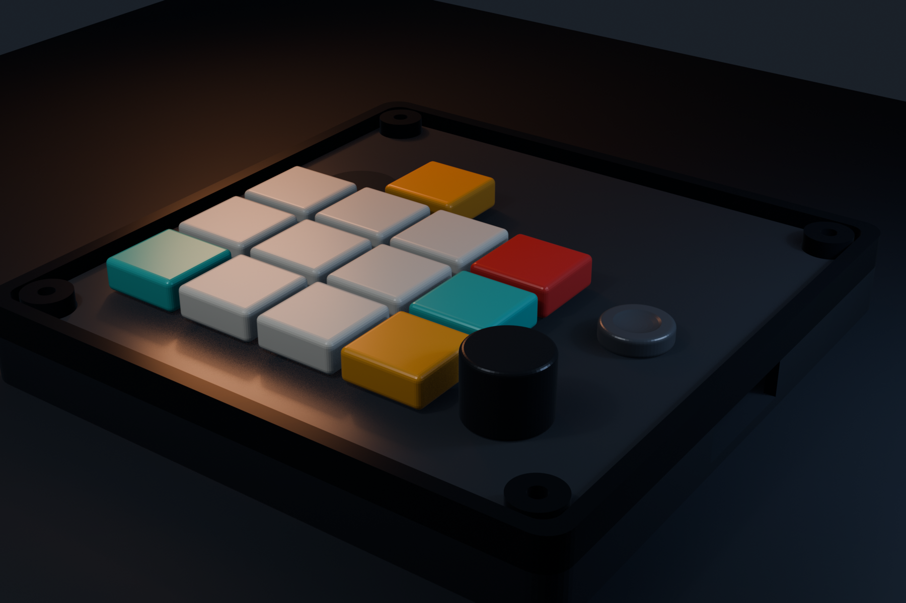

# Mechanical design structure

## Stack baseline

- Separate 1.5 mm MX switch/control plate for the V1 fit-check.
- Common input PCB, nominally 1.6 mm.
- MCU adapter below or beside the input PCB with the XIAO USB-C accessible from the enclosure.
- Enclosure support around encoder, navigation switch, USB connector, and other repeated-load parts.

## Proposed tree

```text
mechanical/
  references/      # manufacturer STEP/DXF with source notes
  plate/           # plate source and exports
  enclosure/       # top/bottom enclosure source and exports
  fixtures/        # assembly and touch/force test fixtures
  exports/         # release-only STEP/DXF/STL when versioned
```

## Locked constraints

- No OLED/LCD window.
- All keys, LEDs, encoder, navigation switch, and touch electrode originate from PCB coordinates.
- The plate or enclosure carries repeated encoder/navigation force instead of relying only on solder pads.
- RF antenna regions remain free of metal plate, battery, dense copper, and enclosure features that violate the board guidance.
- Reset/boot/SWD service access remains possible without destructive disassembly during V1.
- USB cable shell and strain envelope are modeled, not just the receptacle body.

## Dimensions required before CAD release

- Exact MX switch/keycap MPN, travel, and retention tolerance; family, 19 mm pitch, 14.2 mm cutout, and Kailh socket candidate are selected.
- Encoder shaft/body/tab/knob dimensions and target protrusion.
- Navigation switch body, cap, travel, and support surfaces.
- Touch diameter, overlay thickness, and finger clearance.
- Adapter connector stack height and XIAO component/antenna envelopes.
- Battery dimensions, swelling allowance, connector, and retention.
- Fastener diameter, insert/boss geometry, and assembly order.

Build a low-cost plate and enclosure fit check before committing to final material or finish.

## V1 printable fit-check



The repository now includes a parametric Blender generator and three manifold STL fit-check parts:

- bottom PCB tray with four M3-aligned bosses;
- top bezel with a replaceable plate ledge;
- 1.5 mm MX plate with thirteen 14.2 mm switch openings, encoder and navigation openings, and a 0.8 mm touch membrane.

The common PCB is 118 mm square and the body is 125.8 mm × 125.8 mm × 17.0 mm before controls. The low-profile C30 candidate has 2.1 mm nominal clearance to the plate underside, and the 1.85 mm Kailh socket body has 1.25 mm nominal clearance above the case floor. The navigation proxy uses a 14 mm round concave cap over an 11 mm RKJXM-class body. The broad side service slot is provisional because the adapter connector and XIAO USB orientation are not mechanically frozen.

Generate the STL files and preview images with:

```sh
blender --background --factory-startup --python mechanical/scripts/generate_enclosure.py
```

See `mechanical/enclosure/README.md` for print orientation, dimensions, and the explicit fit-check limitations.
